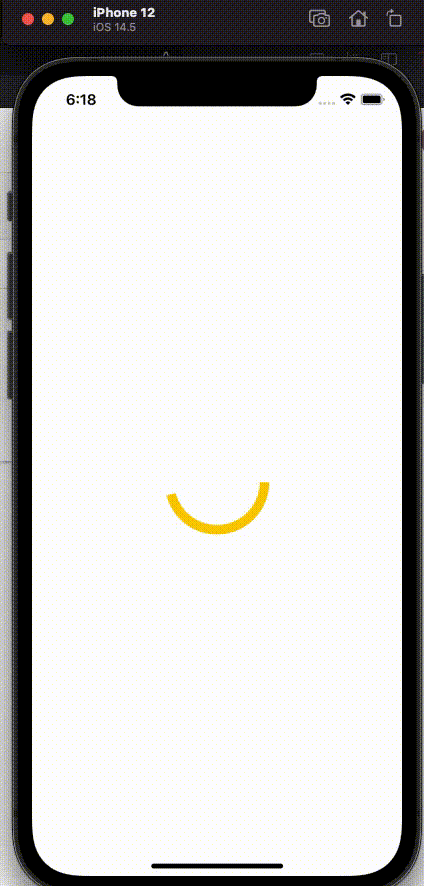

<h1 align="center">
  <br>
  <a href="http://www.ivancoder.com"></a>
</h1>

# Indicador de actividad personalizado

Aplicación móvil para mostrar una animación de un circulo con 4 colores.<br/>
Del video de YouTube [SwiftUI: Custom Activity Indicator](https://www.youtube.com/watch?v=IQ4cuotho-U).

## Índice

- [Instalación](#instalación)
- [Uso](#uso)
- [Características](#características)
- [Vista Previa](#vista-previa)
- [Tecnologías Utilizadas](#tecnologías-utilizadas)
- [Redes Sociales o formas de contacto](#redes-sociales-o-formas-de-contacto)

## Instalación

```bash
# Clonar el repositorio
git clone https://github.com/ivxn31/CustomActivityIndicator.git

# Navegar al directorio del proyecto
cd CustomActivityIndicator
```

## Uso
Compilar el proyecto en Xcode compatible para SwiftUI.

## Características
- Animación Continua: El anillo en la vista principal se anima continuamente, llenándose gradualmente de color en un ciclo sin fin.
- Transiciones Suaves: Utiliza la animación easeIn para lograr transiciones suaves y agradables en la animación del anillo.
- Cambio Dinámico de Colores: Los colores del anillo cambian dinámicamente entre rojo, verde, azul y amarillo, ofreciendo una experiencia visual atractiva.
- Uso de Temporizadores: Un temporizador (Timer) se utiliza para cambiar el color del anillo a intervalos regulares de 0.8 segundos, sincronizado con la duración de la animación.
- Diseño Responsivo: La vista del anillo se adapta a diferentes tamaños de pantalla, manteniendo un diseño centrado y escalable.
- Uso de Shape para el Anillo: La forma del anillo se define mediante una estructura personalizada Ring, que implementa el protocolo Shape de SwiftUI para crear una forma circular animada.

## Vista Previa
<!-- Codigo de ejemplo para darle tamaño a las imagenes y mostrar mas imagenes  -->
<!-- alternativa 01  -->
<!-- alternativa 02 {width=100 height=100} -->
<!--  -->


## Tecnologías Utilizadas
- Lenguaje Swift
- SwiftUI
- Xcode

## Redes Sociales o formas de contacto
<p align="center">
  <a href="https://www.linkedin.com/in/ivan-tecp-martinez/" target="_blank">
    
  </a>
  <a href="https://www.ivancoder.com/" target="_blank">
    
  </a>
</p>

